# System Architecture Reference

Phaeton converts n8n workflows into deployable AWS CDK applications. A user submits an n8n workflow JSON export, Phaeton's managed pipeline analyzes, translates, and packages it, and the user receives a zip archive containing a complete CDK application ready for `cdk deploy`.

For installation and first-run instructions, see the [README](../README.md) and [Getting Started](getting-started.md).

---

## System Overview

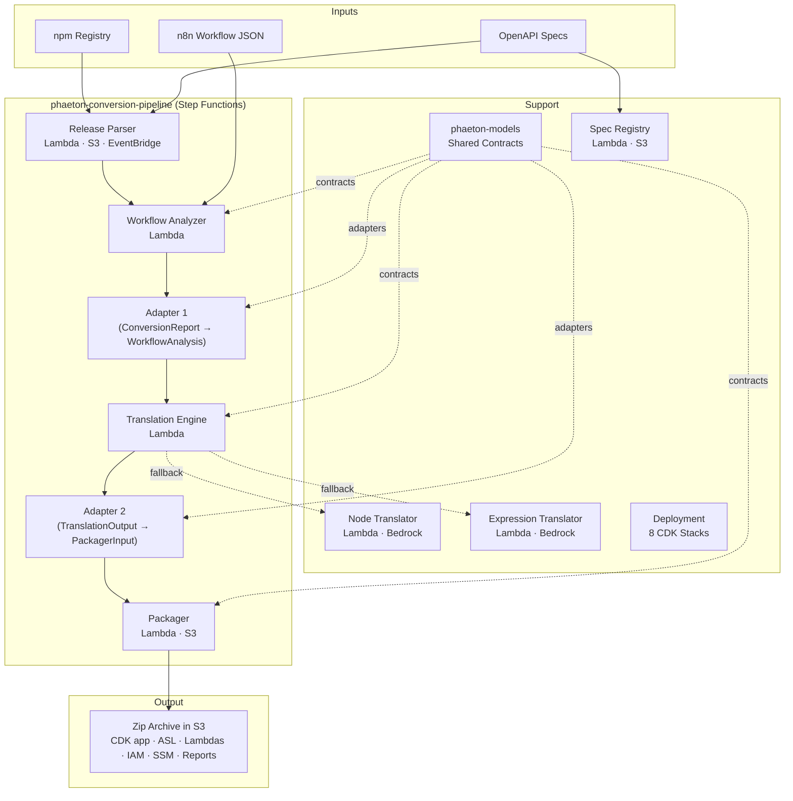

Each service has its own Lambda function, codebase, and test suite. Services communicate only via well-defined contracts defined in phaeton-models. The Adapter Lambda handles data format conversion between stages.

---

## Component Details

### n8n Release Parser

Fetches `n8n-nodes-base` releases from npm, diffs node types across versions, and matches nodes against ~290 OpenAPI/Swagger specifications to build a versioned catalog.

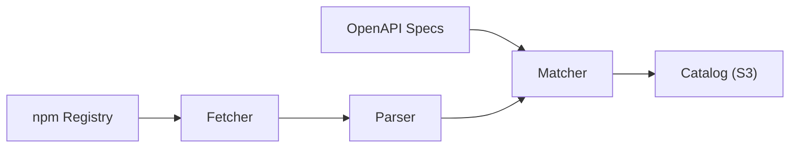

**Key interfaces:**
- CLI: `n8n-release-parser` (Typer)
- Lambda handler: `handler.handler`
- Storage backends: local filesystem, S3 (`CATALOG_BUCKET`)

### Workflow Analyzer

Parses an n8n workflow JSON, classifies every node and expression, builds a dependency graph, analyzes payload sizes, and generates a `ConversionReport` with a confidence score.

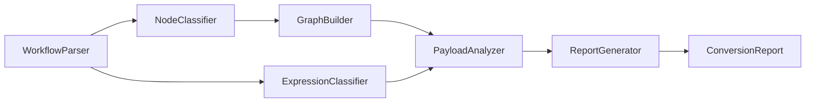

**Key interfaces:**
- `WorkflowAnalyzer.analyze(workflow_path)` — file-based entry point
- `WorkflowAnalyzer.analyze_dict(data)` — dict-based entry point (used by Lambda handler)
- Lambda handler: `handler.handler`
- CLI: `workflow-analyzer <workflow.json> -o <output/>`

**Source:** `workflow-analyzer/src/workflow_analyzer/analyzer.py`

### Translation Engine

Converts a `WorkflowAnalysis` into an ASL state machine definition with supporting Lambda artifacts. Uses a plugin-based translator architecture with an AI agent fallback.

**Pipeline flow:**

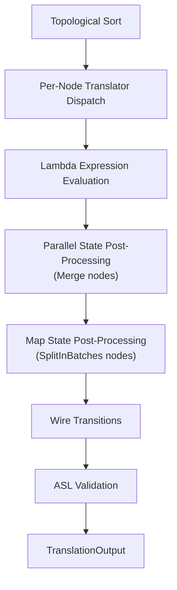

**Translator plugin hierarchy:**

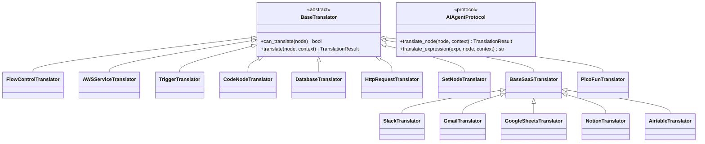

**Translator priority order** (from `create_default_engine()` in `n8n-to-sfn/handler.py`):

| Priority | Translator | Handles |
|----------|-----------|---------|
| 1 | `FlowControlTranslator` | If, Switch, SplitInBatches, Loop, Merge, Wait, NoOp, ExecuteWorkflow |
| 2 | `AWSServiceTranslator` | S3, DynamoDB, SQS, SNS, SES, EventBridge, Lambda |
| 3 | `TriggerTranslator` | ScheduleTrigger, Webhook, ManualTrigger |
| 4 | `CodeNodeTranslator` | Code nodes (Python, JavaScript) |
| 5 | `DatabaseTranslator` | Postgres, MySQL, Microsoft SQL |
| 6 | `HttpRequestTranslator` | HTTP Request nodes |
| 7 | `SetNodeTranslator` | Set/Edit Fields nodes |
| 8 | `SlackTranslator` | Slack API nodes |
| 9 | `GmailTranslator` | Gmail API nodes |
| 10 | `GoogleSheetsTranslator` | Google Sheets API nodes |
| 11 | `NotionTranslator` | Notion API nodes |
| 12 | `AirtableTranslator` | Airtable API nodes |
| 13 | `PicoFunTranslator` | PicoFun API client nodes |
| *fallback* | `AIAgentClient` | Any node not matched above |

For each node, the engine tries translators in order; the first whose `can_translate()` returns `True` wins. If none match and an AI agent is configured, the engine falls back to AI-generated translation.

**Source:** `n8n-to-sfn/src/n8n_to_sfn/engine.py`, `n8n-to-sfn/src/n8n_to_sfn/handler.py`

### Packager

Takes a `PackagerInput` and generates a complete deployable directory, then zips and uploads it to S3.

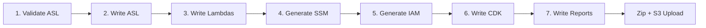

**Lambda handler** (`packager/handler.py`):
1. Validates `PackagerInput` payload
2. Runs `Packager.package()` to generate the output directory at `/tmp/{workflow_name}`
3. Zips the directory
4. Uploads to S3 at `packages/{workflow_name}.zip` in the `OUTPUT_BUCKET`
5. Returns `{status, s3_bucket, s3_key, workflow_name}`

**Source:** `packager/src/n8n_to_sfn_packager/packager.py`, `packager/src/n8n_to_sfn_packager/handler.py`

### Node Translator

Bedrock-powered fallback that translates individual n8n nodes into ASL state definitions when no rule-based translator matches.

### Expression Translator

Bedrock-powered fallback that translates n8n expressions (e.g., `$json.field`, `$node["Name"].json`) into JSONata expressions for ASL when rule-based expression translation is insufficient.

Both translators use the Strands Agents SDK with Claude Sonnet 4 via Amazon Bedrock. They are deployed as separate Lambda functions, each with its own system prompt tuned for its translation domain.

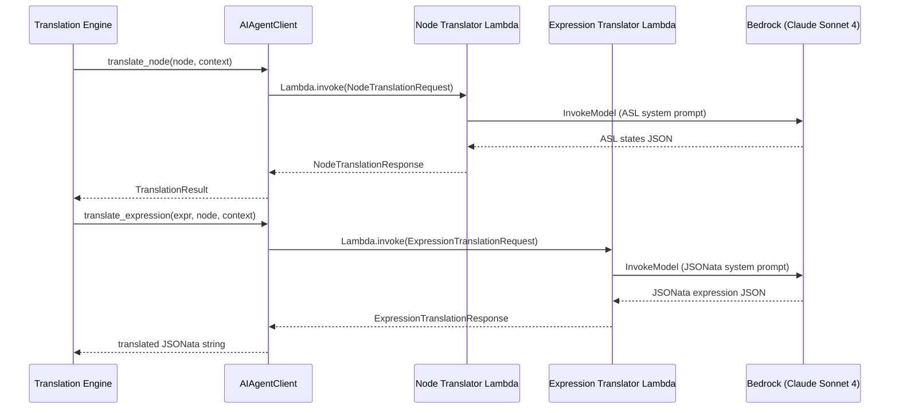

AI-generated translations include `metadata={"ai_generated": True, "confidence": "..."}` so the packager can flag them in the migration checklist.

See [AI Translator Guide](ai-translators.md) for configuration, security, system prompts, and request/response schemas.

### Spec Registry

An indexed registry of API specifications (Swagger 2.0 and OpenAPI 3.x). The spec registry scans uploaded spec files, extracts metadata (service names, authentication types, endpoints), and provides intelligent matching of n8n node types to API specs.

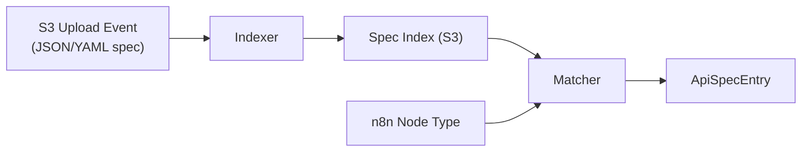

The registry is event-driven: when a spec file is uploaded to the `phaeton-spec-registry` S3 bucket, the indexer Lambda automatically rebuilds the index. The index is consumed by other pipeline components to enrich translation with API context.

**Source:** `spec-registry/src/spec_registry/`

### Deployment

Eight CDK stacks deploy the Phaeton pipeline as managed AWS infrastructure.

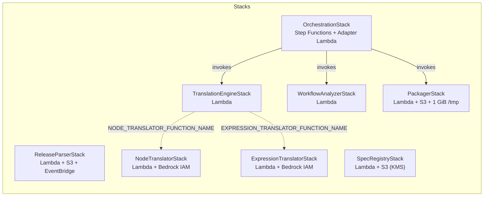

See [Deployment Guide](deployment.md) for deploy commands and configuration.

---

## Shared Models (phaeton-models)

The `phaeton-models` package defines all boundary models that flow between pipeline stages. It is a leaf dependency — it depends on nothing except Pydantic.

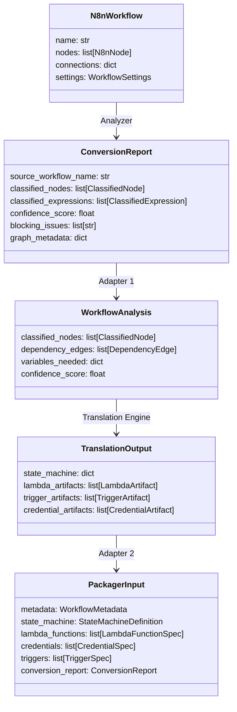

**Disambiguating duplicate type names:**

| Module | `ClassifiedNode` | `ClassifiedExpression` | `ExpressionCategory` |
|--------|------------------|----------------------|---------------------|
| `phaeton_models.analyzer` | `node: N8nNode`, `category: NodeCategory`, `translation_strategy: str` | `node_name`, `raw_expression`, `category` (JSONATA_DIRECT, VARIABLE_REFERENCE, LAMBDA_REQUIRED) | Analyzer-side categories |
| `phaeton_models.translator` | `node: N8nNode`, `classification: NodeClassification`, `expressions: list` | `original`, `category` (JSONATA_DIRECT, REQUIRES_VARIABLES, REQUIRES_LAMBDA) | Translator-side categories |

**Leaf dependency rule:** phaeton-models must NEVER depend on any service package (n8n-to-sfn, packager, workflow-analyzer, etc.), not even as dev dependencies. This prevents circular dependency resolution failures in uv.

---

## Adapter Pattern

Two adapters in `phaeton_models/adapters/` bridge the contract gap between pipeline stages. They handle enum remapping, field renaming, and structural transformation.

### Adapter 1: ConversionReport → WorkflowAnalysis

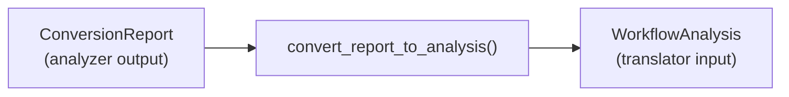

**Expression category mapping:**

| Analyzer (`phaeton_models.analyzer`) | Translator (`phaeton_models.translator`) |
|--------------------------------------|------------------------------------------|
| `JSONATA_DIRECT` | `JSONATA_DIRECT` |
| `VARIABLE_REFERENCE` | `REQUIRES_VARIABLES` |
| `LAMBDA_REQUIRED` | `REQUIRES_LAMBDA` |

**Key transformations:**
- **Expression redistribution:** Flat top-level `classified_expressions` list → grouped by `node_name` into per-node `expressions` lists on each `ClassifiedNode`
- **Node classification:** `NodeCategory` enum values pass through directly (identical string values)
- **Graph edges:** `graph_metadata.edges[]` parsed into `DependencyEdge` objects with `edge_type` mapping (`connection` → `CONNECTION`, `data_reference` → `DATA_REFERENCE`)
- **Payload warnings:** `PayloadWarning` objects → formatted strings (`"{node_name}: {description}"`)

**Source:** `shared/phaeton-models/src/phaeton_models/adapters/analyzer_to_translator.py`

### Adapter 2: TranslationOutput → PackagerInput

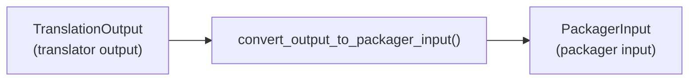

**Trigger type mapping:**

| Translation Engine (`translator_output`) | Packager (`packager_input`) |
|------------------------------------------|-----------------------------|
| `EVENTBRIDGE_SCHEDULE` | `SCHEDULE` |
| `LAMBDA_FURL` | `WEBHOOK` |
| `MANUAL` | `MANUAL` |

**Runtime mapping:**

| Translation Engine | Packager |
|-------------------|----------|
| `PYTHON` (uppercase) | `python` (lowercase) |
| `NODEJS` (uppercase) | `nodejs` (lowercase) |

**Key transformations:**
- **Lambda function type inference:** Heuristic based on `function_name` — names containing "webhook" → `WEBHOOK_HANDLER`, "callback" → `CALLBACK_HANDLER`, "oauth"/"refresh_token" → `OAUTH_REFRESH`, "picofun"/"api_client" → `PICOFUN_API_CLIENT`, otherwise runtime-based default (`CODE_NODE_PYTHON` or `CODE_NODE_JS`)
- **OAuth credential splitting:** Credentials with `auth_type == "oauth2"` are separated into `oauth_credentials` list as `OAuthCredentialSpec` objects
- **Confidence normalization:** Scores > 1.0 are divided by 100 (percentage → fraction)
- **Metadata construction:** `WorkflowMetadata` assembled from `conversion_report` dict fields with fallback defaults

**Source:** `shared/phaeton-models/src/phaeton_models/adapters/translator_to_packager.py`

---

## Ports and Adapters

Each component follows the ports-and-adapters (hexagonal) architecture pattern. Core business logic is isolated from infrastructure concerns, with two adapter layers providing entry points:

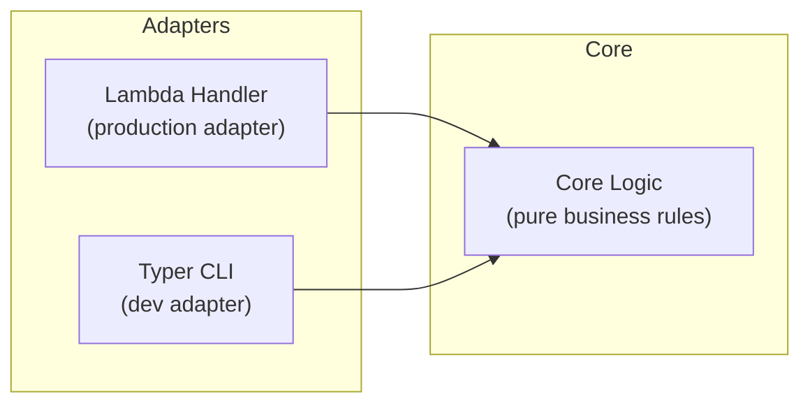

**Lambda handler** (`handler.py`) — The production entry point. Accepts JSON payloads, validates with Pydantic, delegates to core logic, and returns structured responses. This is the primary interface for all components.

**CLI adapter** (`cli.py`) — A Typer-based command-line interface for local development and testing. CLI modules are dev dependencies only and are excluded from Lambda deployment bundles (via `exclude=["*/cli.py", "*/__main__.py"]` in CDK bundling options).

**Core logic** — Pure business logic with no infrastructure dependencies. In translator components this is `agent.py`; in the workflow analyzer it is `analyzer.py` and its submodules; in the packager it is `packager.py` and its writers.

This separation enables:
- Testing core logic without Lambda runtime or AWS credentials
- Swapping adapters without changing business rules
- Keeping Lambda deployment bundles minimal

---

## Operational Concerns

### Resource Sizing

| Lambda | Memory | Timeout | Ephemeral Storage | Notes |
|--------|--------|---------|-------------------|-------|
| `phaeton-release-parser` | 512 MB | 120 s | default | npm fetch + parsing |
| `phaeton-workflow-analyzer` | 512 MB | 120 s | default | Graph analysis |
| `phaeton-node-translator` | 1024 MB | 120 s | default | Bedrock invocation (node → ASL) |
| `phaeton-expression-translator` | 1024 MB | 120 s | default | Bedrock invocation (expression → JSONata) |
| `phaeton-spec-indexer` | 512 MB | 120 s | default | API spec indexing |
| `phaeton-translation-engine` | 512 MB | 300 s | default | May invoke AI translators |
| `phaeton-packager` | 1024 MB | 300 s | 1 GiB | File generation + zip |
| `phaeton-adapter` | 256 MB | 30 s | default | Lightweight data mapping |

All Lambda functions use Python 3.13 runtime with ARM64 (Graviton) architecture.

### Retry Behavior

- All `LambdaInvoke` tasks in the Step Functions state machine set `retry_on_service_exceptions=True`, which retries on `Lambda.ServiceException`, `Lambda.AWSLambdaException`, `Lambda.SdkClientException`, and `Lambda.TooManyRequestsException`
- Pipeline timeout: 30 minutes (`cdk.Duration.minutes(30)`)
- Each step has `add_catch(fail_state)` for non-retryable errors

### Error Handling

All Lambda handlers use a structured `_error_response()` pattern:

```json
{
  "error": {
    "status_code": 400,
    "error_type": "ValidationError",
    "message": "Invalid payload: 3 validation error(s)",
    "details": [...]
  }
}
```

### Failure Modes

| Failure | Status Code | Handler | Cause |
|---------|-------------|---------|-------|
| Invalid input payload | 400 | All handlers | Pydantic `ValidationError` |
| Translation error | 422 | Translation Engine | `TranslationError` (ASL generation failure) |
| Packaging error | 422 | Packager | `PackagerError` (file generation failure) |
| S3 upload failure | 500 | Packager | boto3 S3 exception |
| Missing `OUTPUT_BUCKET` | 500 | Packager | Environment variable not set |
| AI agent timeout | 500 | Translation Engine | Lambda invoke timeout |
| Unexpected error | 500 | All handlers | Unhandled exception |

### Monitoring Points

- **Lambda CloudWatch logs:** All handlers use `aws_lambda_powertools.Logger` with structured JSON logs including `function_name`, `function_arn`, and `function_request_id`
- **Step Functions execution history:** Full state-by-state execution audit trail in the AWS console
- **S3 object creation events:** Output zip creation at `packages/{workflow_name}.zip`

### Scaling

Each pipeline execution is independent. Concurrent executions are limited by:
- Lambda concurrent execution quotas (per-function and account-level)
- Step Functions execution quotas (standard workflows: 1M open executions per region)
- S3 request rate limits (3,500 PUT/s per prefix)

---

## Extensibility Guide

### Adding a New Translator

1. Create a new class extending `BaseTranslator` in `n8n-to-sfn/src/n8n_to_sfn/translators/`
2. Implement `can_translate(node: ClassifiedNode) -> bool` — return `True` for nodes this translator handles
3. Implement `translate(node: ClassifiedNode, context: TranslationContext) -> TranslationResult` — return ASL states and artifacts
4. Register in `create_default_engine()` in `n8n-to-sfn/handler.py` at the appropriate priority position (earlier = higher priority)

### Adding a New Node Type

1. Add classification logic in `NodeClassifier` (`workflow-analyzer/src/workflow_analyzer/classifier/node_classifier.py`)
2. Create or update a translator plugin (see above)
3. Add the node type to [Supported Node Types](supported-node-types.md)

### Adding a New Adapter

1. Create a new module in `shared/phaeton-models/src/phaeton_models/adapters/`
2. Import only from `phaeton_models.*` submodules — never from service packages (leaf dependency rule)
3. Define any new boundary models within `phaeton_models` submodules

### Adding a New Writer to the Packager

1. Create a new writer class in `packager/src/n8n_to_sfn_packager/writers/`
2. Add the writer as an instance variable in `Packager.__init__()`
3. Add a `_step_*` method and call it in `Packager.package()`

### Modifying Shared Models

1. Update the model in the appropriate `phaeton_models` module
2. Update any adapters that reference the changed fields
3. Run contract tests: `pytest tests/contract/`
4. Run affected component test suites

---

## Cross-Cutting Concerns

**Immutability:** All Pydantic models use `frozen=True`. Mutations use `model_copy(update={...})`.

**ASL validation:** JSON Schema validation runs at both translation time (in the engine, producing warnings) and packaging time (in the `ASLWriter`, raising `PackagerError` on failure).

**Expression translation:** n8n expressions like `{{ $json.field }}` are translated to JSONata expressions for use in ASL (see [ADR-003](adr/003-jsonata-query-language.md)).

**Credential management:** Credentials are never embedded in generated code. The packager generates SSM Parameter Store placeholders with paths like `/phaeton/creds/{name}`. Users populate these parameters before deploying. OAuth2 credentials get dedicated `OAuthCredentialSpec` entries with token rotation configuration.

---

## Architecture Decision Records

See [ADR index](adr/README.md) for full details.

| ADR | Title | Summary |
|-----|-------|---------|
| [001](adr/001-microservice-architecture.md) | Microservice Architecture | 4 independent components with shared boundary models |
| [002](adr/002-pydantic-v2-models.md) | Pydantic v2 for All Data Models | Pydantic v2 BaseModel for all inter-component contracts |
| [003](adr/003-jsonata-query-language.md) | JSONata Query Language | ASL state machines use JSONata instead of JSONPath |
| [004](adr/004-strands-agents-ai-service.md) | Strands Agents for AI Service | Strands Agents framework with Bedrock for AI fallback |
| [005](adr/005-lambda-function-urls.md) | Lambda Function URLs for Webhooks | Function URLs instead of API Gateway for webhooks |
| [006](adr/006-rds-data-api.md) | RDS Data API for Databases | RDS Data API calls instead of VPC-bound drivers |
| [007](adr/007-uv-package-manager.md) | uv Package Manager | uv for dependency management and builds |
