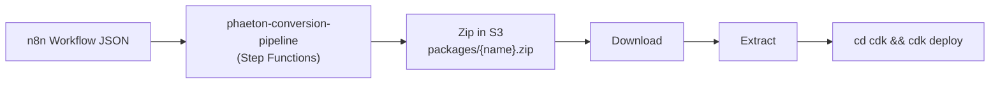
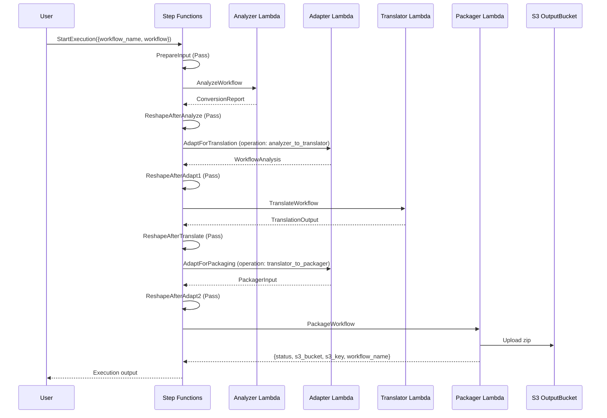
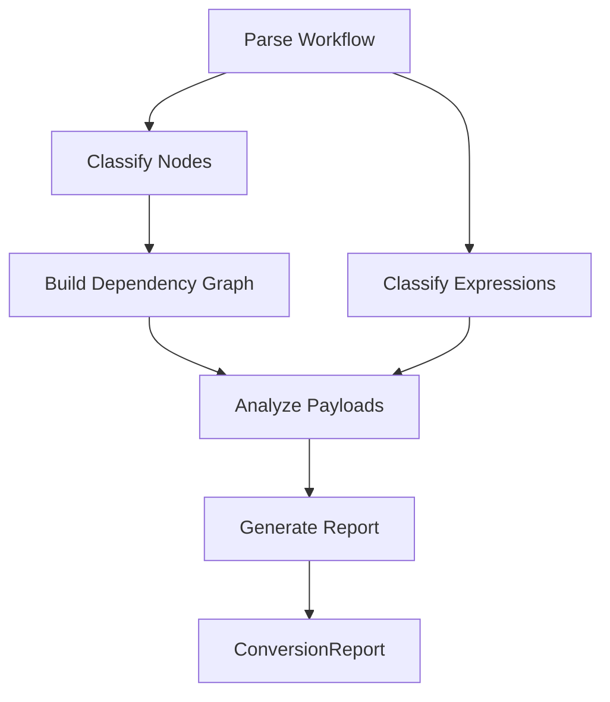
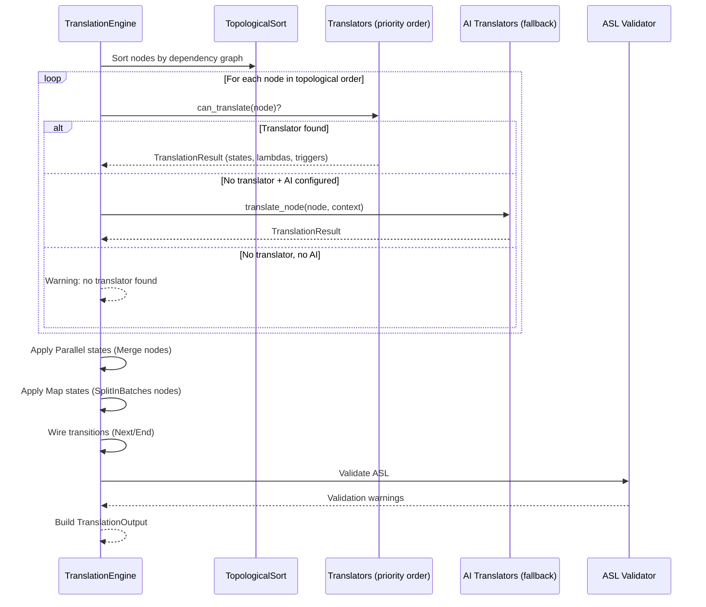
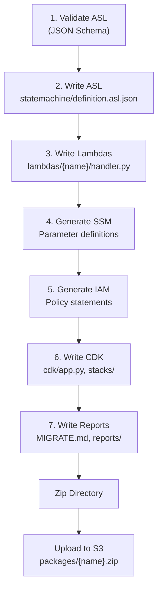

# End-to-End Workflow & Data Flow

This document traces an n8n workflow from submission through to a deployable zip archive. Two paths exist: the **managed AWS pipeline** (primary) and **local CLI** (development/testing).

For prerequisites and installation, see [Getting Started](getting-started.md). For component internals, see [Architecture](architecture.md).

---

## The Big Picture



User submits a workflow JSON → the managed pipeline analyzes, translates, and packages it → a zip archive appears in S3 → user downloads, extracts, and deploys with `cdk deploy`.

---

## Managed Pipeline Flow

The Step Functions state machine (`phaeton-conversion-pipeline`) orchestrates the full conversion. Reshape (Pass) states unwrap `$.lambda_result.Payload` between Lambda invocations.



**About Reshape states:** Lambda invocations via `LambdaInvoke` wrap their results under `$.lambda_result.Payload`. The Pass (Reshape) states unwrap this so the next step receives the payload directly at `$.service_data`.

**Final output:**
```json
{
  "status": "success",
  "s3_bucket": "phaeton-output-bucket-...",
  "s3_key": "packages/my-workflow.zip",
  "workflow_name": "my-workflow"
}
```

---

## Stage-by-Stage Data Flow

### Input: n8n Workflow JSON

The pipeline starts with a raw n8n workflow JSON export. Structure:

```json
{
  "name": "my-workflow",
  "nodes": [
    {"id": "...", "name": "...", "type": "n8n-nodes-base.xxx", "typeVersion": 1, "position": [...], "parameters": {...}}
  ],
  "connections": {
    "NodeName": {"main": [[{"node": "NextNode", "type": "main", "index": 0}]]}
  },
  "settings": {"executionOrder": "v1"}
}
```

**Key model:** `N8nWorkflow` (fields: `name`, `nodes: list[N8nNode]`, `connections`, `settings: WorkflowSettings`)

### Stage 1: Analyze

The Workflow Analyzer classifies every node and expression, builds a dependency graph, and assesses conversion feasibility.



**Input:** `N8nWorkflow` (as JSON dict) \
**Output:** `ConversionReport`

Key output fields:
- `classified_nodes` — each node paired with a `NodeCategory` (AWS_NATIVE, FLOW_CONTROL, TRIGGER, CODE_JS, CODE_PYTHON, etc.)
- `classified_expressions` — flat list of all expressions with their `ExpressionCategory` (JSONATA_DIRECT, VARIABLE_REFERENCE, LAMBDA_REQUIRED)
- `graph_metadata` — dependency graph including edges with source/target nodes and edge types
- `confidence_score` — overall conversion feasibility (0.0–1.0)
- `blocking_issues` — list of issues that prevent conversion

### Adapter 1: ConversionReport → WorkflowAnalysis

The first adapter bridges the analyzer's output format to the translator's input format.

**Expression category remapping:**

| Analyzer | Translator |
|----------|-----------|
| `JSONATA_DIRECT` | `JSONATA_DIRECT` |
| `VARIABLE_REFERENCE` | `REQUIRES_VARIABLES` |
| `LAMBDA_REQUIRED` | `REQUIRES_LAMBDA` |

**Structural transformations:**
- **Expression redistribution:** The analyzer produces a flat top-level list of `ClassifiedExpression` objects. The adapter groups them by `node_name` and attaches them to each `ClassifiedNode.expressions` list.
- **Graph edge parsing:** Raw edge dicts from `graph_metadata.edges[]` are parsed into typed `DependencyEdge(from_node, to_node, edge_type, output_index)` objects.
- **Payload warnings:** `PayloadWarning` objects are flattened to formatted strings.

### Stage 2: Translate

The Translation Engine converts each classified node into ASL states and supporting artifacts.



**Input:** `WorkflowAnalysis` \
**Output:** `TranslationOutput`

Key output fields:
- `state_machine` — complete ASL definition as a dict (`{"StartAt": "...", "States": {...}}`)
- `lambda_artifacts` — generated Lambda functions (function_name, runtime, handler_code, dependencies)
- `trigger_artifacts` — trigger infrastructure specs (EventBridge schedules, webhook Function URLs)
- `credential_artifacts` — SSM parameter placeholders for credentials
- `conversion_report` — translation statistics (total nodes, translated nodes, classification breakdown)

**Example transformation:**

An n8n DynamoDB PutItem node classified as `AWS_NATIVE` translates to an ASL Task state:

```
n8n node:                          ASL state:
  type: awsDynamoDB                  Type: Task
  operation: create                  Resource: arn:aws:states:::dynamodb:putItem
  tableName: MyTable                 Arguments: {TableName: "MyTable", ...}
```

### Adapter 2: TranslationOutput → PackagerInput

The second adapter converts the translator's output to the packager's input format.

**Trigger type remapping:**

| Translation Engine | Packager |
|-------------------|----------|
| `EVENTBRIDGE_SCHEDULE` | `SCHEDULE` |
| `LAMBDA_FURL` | `WEBHOOK` |
| `MANUAL` | `MANUAL` |

**Key transformations:**
- **Lambda function type inference:** Based on `function_name` heuristics — "webhook" → `WEBHOOK_HANDLER`, "callback" → `CALLBACK_HANDLER`, "oauth" → `OAUTH_REFRESH`, "picofun" → `PICOFUN_API_CLIENT`, otherwise `CODE_NODE_PYTHON` or `CODE_NODE_JS` based on runtime
- **OAuth credential splitting:** Credentials with `auth_type == "oauth2"` are separated into a dedicated `oauth_credentials` list with token endpoint and refresh schedule configuration
- **Confidence normalization:** Scores > 1.0 are divided by 100 (handles percentage vs. fraction)
- **Metadata assembly:** `WorkflowMetadata` constructed from `conversion_report` dict with defaults for missing fields

### Stage 3: Package

The Packager generates all files for the deployable CDK application.



**Input:** `PackagerInput` \
**Output:** Zip archive uploaded to S3

The Lambda handler:
1. Validates the `PackagerInput` payload
2. Generates the output directory at `/tmp/{workflow_name}`
3. Runs all 7 packaging steps
4. Zips the directory to `/tmp/{workflow_name}.zip`
5. Uploads to `s3://{OUTPUT_BUCKET}/packages/{workflow_name}.zip`
6. Returns `{status: "success", s3_bucket, s3_key, workflow_name}`

---

## Output: The Deployable Zip

```
{workflow_name}.zip
├── statemachine/
│   └── definition.asl.json          # ASL state machine definition
├── lambdas/
│   └── {function_name}/
│       ├── handler.py                # Lambda function code
│       └── requirements.txt          # Function dependencies (if any)
├── cdk/
│   ├── app.py                        # CDK application entry point
│   ├── stacks/
│   │   └── workflow_stack.py         # CDK stack with all AWS resources
│   ├── pyproject.toml                # CDK project dependencies
│   └── cdk.json                      # CDK configuration
├── MIGRATE.md                        # Migration checklist (manual steps)
├── CREDENTIALS.md                    # SSM parameter setup instructions
├── README.md                         # Deployment instructions for this workflow
└── reports/
    ├── conversion_report.json        # Machine-readable conversion report
    └── conversion_report.md          # Human-readable conversion report
```

| File | Purpose | Manual editing needed? |
|------|---------|----------------------|
| `definition.asl.json` | Step Functions state machine | Only if AI-translated states need review |
| `lambdas/*/handler.py` | Lambda function code | Only for AI-generated or code node functions |
| `cdk/app.py` | CDK entry point | No |
| `cdk/stacks/workflow_stack.py` | AWS resource definitions | Only for custom resource config |
| `MIGRATE.md` | Post-deployment checklist | Follow the steps |
| `CREDENTIALS.md` | SSM parameter values to populate | Provide credential values |
| `reports/conversion_report.md` | Conversion summary and warnings | Review only |

---

## Deploying the Output

1. **Download the zip from S3** (via AWS CLI or Console):
   ```bash
   aws s3 cp s3://{bucket}/packages/{workflow_name}.zip .
   ```

2. **Extract:**
   ```bash
   unzip {workflow_name}.zip -d {workflow_name}
   cd {workflow_name}
   ```

3. **Populate SSM parameters** per `CREDENTIALS.md`:
   ```bash
   aws ssm put-parameter --name "/phaeton/creds/{name}" --value "..." --type SecureString
   ```

4. **Validate with CDK synth:**
   ```bash
   cd cdk
   uv sync
   uv run cdk synth
   ```

5. **Deploy:**
   ```bash
   uv run cdk deploy
   ```

6. **Test** in the [Step Functions console](https://console.aws.amazon.com/states/) — start an execution and verify the state machine graph and output.

---

## Local CLI Flow

For development and testing, you can run each pipeline stage locally via CLI commands instead of the managed pipeline. This is useful for debugging individual stages.

```bash
# 1. Analyze the workflow
cd workflow-analyzer
uv run workflow-analyzer path/to/workflow.json -o ../analysis/

# 2. Translation is a library — invoke programmatically or use the handler:
cd ../n8n-to-sfn
uv run python -m n8n_to_sfn.handler analysis/workflow_analysis.json > translation_output.json

# 3. Package the output
cd ../packager
uv run python -m n8n_to_sfn_packager --input translation_output.json -o ../output/
```

The local flow produces the same directory structure as the managed pipeline but skips the zip/S3 upload step. See [Getting Started](getting-started.md) for a full walkthrough.

---

## Data Transformation Summary

| Stage | Input | Output | Key Transformation |
|-------|-------|--------|--------------------|
| Parse | Raw JSON | `N8nWorkflow` | JSON validation, Pydantic model construction |
| Analyze | `N8nWorkflow` | `ConversionReport` | Node classification, expression analysis, dependency graph, feasibility scoring |
| Adapt 1 | `ConversionReport` | `WorkflowAnalysis` | Expression redistribution (flat → per-node), enum remapping, edge parsing |
| Translate | `WorkflowAnalysis` | `TranslationOutput` | ASL generation, Lambda code generation, trigger/credential artifact creation |
| Adapt 2 | `TranslationOutput` | `PackagerInput` | Trigger type remapping, function type inference, OAuth splitting, confidence normalization |
| Package | `PackagerInput` | Zip archive in S3 | ASL validation, file generation (CDK, Lambdas, IAM, SSM, reports), zip + S3 upload |
